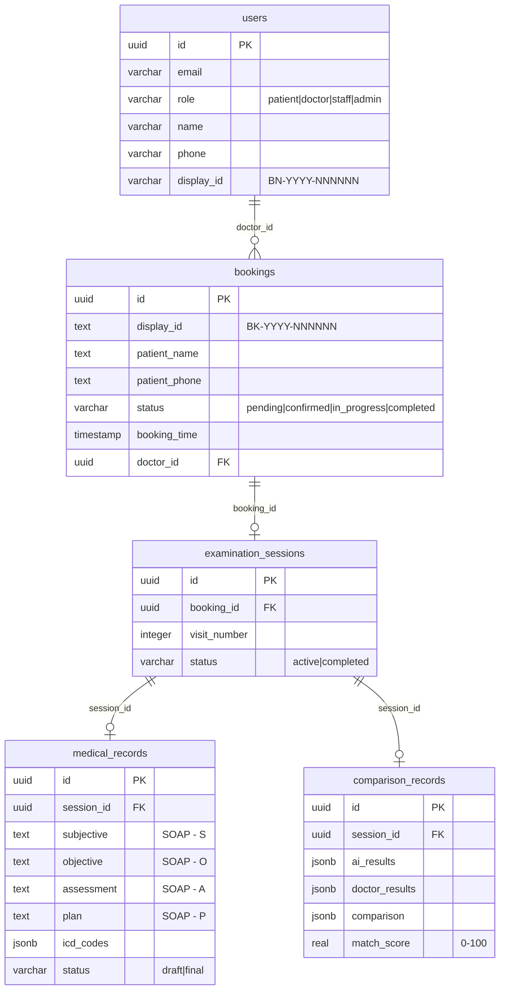

# 📊 BÁO CÁO DỰ ÁN: Medical Examination Assistant (MEA)

**Ngày review**: 2026-03-02  
**Trạng thái**: MVP/Demo Complete  
**Developer**: Solo

---

## 🎯 App này làm gì?

**MEA - Medical Examination Assistant** là ứng dụng hỗ trợ bác sĩ trong quy trình khám bệnh. App sử dụng AI để:
1. **Ghi âm cuộc hội thoại** giữa bác sĩ và bệnh nhân
2. **Chuyển giọng nói → văn bản** (Speech-to-Text) với nhận diện vai trò (ai nói gì)
3. **Phân tích AI** tự động tạo SOAP notes, gợi ý mã ICD-10, tư vấn y khoa
4. **So sánh AI vs Bác sĩ** - đánh giá độ chính xác để cải thiện AI

---

## 🏗️ Kiến trúc hệ thống

```
┌──────────────────────┐       ┌──────────────────────┐
│   Frontend (FE)       │       │   Backend (BE)        │
│   Next.js 16.1        │ ◄───► │   NestJS 11           │
│   React 19            │  API  │   Drizzle ORM         │
│   TailwindCSS 4       │       │   LangGraph           │
│   Supabase Auth       │       │   Ollama (Local LLM)  │
│   Port: 3000          │       │   Port: 4000          │
└──────────────────────┘       └───────┬──────────────┘
                                       │
                   ┌───────────────────┼───────────────────┐
                   ▼                   ▼                   ▼
          ┌────────────┐    ┌──────────────┐    ┌──────────────┐
          │ Supabase   │    │ WhisperX     │    │ Ollama       │
          │ PostgreSQL │    │ STT Server   │    │ LLM Server   │
          │ (Cloud DB) │    │ Python/CUDA  │    │ Local AI     │
          │            │    │ Port: 8080   │    │ Port: 11434  │
          └────────────┘    └──────────────┘    └──────────────┘
```

---

## 📁 Cấu trúc dự án

```
agent_skill_kits/
├── medical-examination-assistant-be-kit/   # 🔧 Backend (NestJS)
│   ├── src/
│   │   ├── admin/              # Quản trị hệ thống
│   │   ├── agents/             # AI Agents (LangGraph)
│   │   │   ├── graph/          # Multi-agent workflow (Scribe → ICD + Expert)
│   │   │   ├── models/         # Ollama LLM client
│   │   │   └── services/       # Agent node implementations
│   │   ├── analyze/            # Phân tích transcript
│   │   ├── booking/            # Quản lý lịch hẹn
│   │   ├── comparison/         # So sánh AI vs Bác sĩ
│   │   ├── common/             # DTOs, Filters, Pipes
│   │   ├── dashboard/          # Thống kê dashboard
│   │   ├── database/           # Drizzle ORM + Schemas
│   │   │   ├── schema/         # 5 tables: users, bookings, sessions, records, comparisons
│   │   │   └── repositories/   # DB access layer
│   │   ├── his/                # Tích hợp HIS (Hospital Information System)
│   │   ├── medical-record/     # Bệnh án SOAP
│   │   ├── patient/            # Quản lý bệnh nhân
│   │   ├── rag/                # RAG (knowledge base protocols)
│   │   ├── session/            # Phiên khám bệnh
│   │   └── stt/                # Speech-to-Text pipeline
│   ├── whisperx_server.py      # WhisperX STT server (Python)
│   ├── data/                   # Knowledge base + vector store
│   └── vercel.json             # Deploy config
│
├── medical-examination-assistant-fe-kit/   # 🎨 Frontend (Next.js)
│   ├── src/
│   │   ├── app/
│   │   │   ├── dashboard/      # Dashboard (2 tabs: Active + History)
│   │   │   ├── examination/    # Trang khám bệnh (4 steps progressive)
│   │   │   └── layout.tsx      # Root layout
│   │   ├── components/
│   │   │   ├── ui/             # Button, Card, Badge, Input, Tabs, Toast, Textarea
│   │   │   ├── MatchingEngine  # AI vs Doctor comparison display
│   │   │   ├── MedicalRecordReview  # Doctor review form
│   │   │   ├── PatientFormModal     # Tạo bệnh nhân mới
│   │   │   ├── PatientSearchModal   # Tìm kiếm bệnh nhân
│   │   │   └── SessionInitForm      # Khởi tạo phiên khám
│   │   └── lib/
│   │       ├── agents/         # Client-side AI (⚠️ nên chuyển sang server)
│   │       ├── db/             # Drizzle schema (FE-side)
│   │       ├── services/       # API client services
│   │       └── api-client.ts   # HTTP client
│   └── vercel.json             # Deploy config
│
├── whisper.cpp/                # Whisper.cpp (legacy - 1465 files)
├── whisper_server.py           # Faster-Whisper simple server (legacy)
│
└── docs/                       # Documentation
    ├── PLAN-production-roadmap.md     # Roadmap 4-6 tuần
    ├── PLAN-accuracy-evaluation.md    # Evaluation kit plan
    ├── PLAN-mcp-debugging.md          # MCP learning plan
    ├── ollama-local-migration.md      # Migration sang local AI
    └── learning/                      # MCP learning modules
```

---

## 🛠️ Công nghệ sử dụng

| Thành phần | Công nghệ | Version |
|------------|-----------|---------|
| **Frontend** | Next.js | 16.1 |
| **FE UI** | TailwindCSS | 4 |
| **FE Components** | Lucide React, clsx, tailwind-merge | latest |
| **FE Auth** | Supabase SSR | 0.8 |
| **Backend** | NestJS | 11 |
| **ORM** | Drizzle ORM | 0.45 |
| **Database** | Supabase PostgreSQL | Cloud |
| **AI Framework** | LangChain + LangGraph | v1.x |
| **Local LLM** | Ollama (qwen3:4b, llama3.2, phi3:3.8b) | Local |
| **STT** | WhisperX (Python/FastAPI) | Local |
| **Deployment** | Vercel (FE + BE) | v2 |

---

## 🗄️ Database Schema (5 bảng chính)



---

## 🤖 AI Pipeline (Core Feature)

### STT Pipeline (Speech-to-Text)
```
Audio File
    ↓
WhisperX Server (Python)
    → Transcribe (speech → text)
    → Align (precise timestamps)
    → Diarize (speaker separation)
    ↓
Ollama LLM (Role Detection)
    → Phân biệt Bác sĩ / Bệnh nhân dựa trên nội dung
    ↓
Ollama LLM (Medical Text Fixer)
    → Sửa lỗi thuật ngữ y khoa (chỉ fix, không thêm)
    ↓
Output: Structured Transcript với roles
```

### AI Analysis Pipeline (LangGraph Multi-Agent)
```
Transcript Text
    ↓
┌─────────────────────┐
│   Scribe Agent      │  ← Ollama (qwen3:4b)
│   → SOAP Notes      │
└─────────┬───────────┘
          ├──────────────────┐
          ▼                  ▼
┌─────────────────┐  ┌─────────────────┐
│  ICD-10 Agent   │  │  Expert Agent   │  ← Ollama (llama3.2)
│  → ICD codes    │  │  → Medical      │
│  → Suggestions  │  │     Advice      │
└─────────────────┘  └─────────────────┘
          │                  │
          ▼                  ▼
      Final Analysis: SOAP + ICD + Advice + References
```

### Comparison Engine
```
AI Results (SOAP + ICD)  ⟷  Doctor Results (SOAP + ICD)
                    ↓
        Semantic Similarity Scoring
        ICD Code Matching
        Overall Match Score (0-100%)
                    ↓
        Saved to comparison_records table
```

---

## 🚀 Cách chạy

### Prerequisites
```bash
# 1. Ollama (Local LLM)
ollama pull qwen3:4b
ollama pull llama3.2
ollama serve  # Port 11434

# 2. WhisperX STT Server
conda activate whisperx
cd medical-examination-assistant-be-kit
python whisperx_server.py --port 8080

# 3. Supabase PostgreSQL (đã setup cloud)
```

### Backend
```bash
cd medical-examination-assistant-be-kit
npm install
npm run start:dev          # Dev mode - Port 4000
# hoặc
npm run build && npm run start:prod
```

### Frontend
```bash
cd medical-examination-assistant-fe-kit
npm install --legacy-peer-deps
npm run dev                # Dev mode - Port 3000
```

### Deployment
```bash
# Cả FE và BE đều deploy lên Vercel
# FE: vercel.json với --legacy-peer-deps
# BE: vercel.json route all → dist/main.js
```

---

## 📊 Flow khám bệnh (User Journey)

```
1. Dashboard
   → Xem danh sách booking (Active tab)
   → Tìm kiếm bệnh nhân (History tab)
   → Tạo bệnh nhân mới (Modal)
   
2. Bắt đầu khám (Click booking → Examination Page)
   → Step 1: Ghi âm hội thoại (Recording / Manual input)
   → Step 2: STT Processing (auto)
   → Step 3: AI Analysis + Doctor Review Form
   → Step 4: AI vs Doctor Comparison  
   
3. Lưu kết quả
   → Save medical record (draft → final)
   → Comparison score saved
```

---

## 🏥 ĐÁNH GIÁ SỨC KHỎE CODE

### ✅ Điểm tốt

| # | Điểm tốt | Chi tiết |
|---|----------|----------|
| 1 | **Kiến trúc module rõ ràng** | NestJS modular: mỗi feature là 1 module riêng (10 modules) |
| 2 | **Multi-agent AI pipeline** | LangGraph orchestration cho 3 AI agents chạy song song |
| 3 | **Full local AI** | Đã migrate thành công từ Groq/Cloud → Ollama + WhisperX local |
| 4 | **Schema design tốt** | Drizzle ORM với PostgreSQL, relationships rõ ràng |
| 5 | **DTOs đã có** | Booking, Comparison, Medical Record, STT, Analyze đều có DTOs |
| 6 | **ValidationPipe enabled** | Global validation với `whitelist: true, forbidNonWhitelisted: true` |
| 7 | **CORS configured** | Whitelist origins, credentials support |
| 8 | **UI Component Library** | Có reusable components: Button, Card, Badge, Input, Tabs, Toast |
| 9 | **Progressive UX** | Examination page với 4 steps, trạng thái rõ ràng |
| 10 | **Documentation** | Production roadmap, migration guide, learning modules |

### ⚠️ Cần cải thiện

| # | Vấn đề | Ưu tiên | Chi tiết | Gợi ý |
|---|--------|---------|----------|-------|
| 1 | **Không có Authentication** | 🔴 **CRITICAL** | Không có JWT, không có login/register, tất cả endpoints đều public | Implement NestJS Passport JWT + Supabase Auth |
| 2 | **API Keys lộ trong .env** | 🔴 **CRITICAL** | `.env` chứa Supabase URL, passwords, HF token | Rotate tất cả keys, đảm bảo .env không commit |
| 3 | **FE có AI libraries** | 🔴 **HIGH** | Frontend bundle chứa `@langchain/*`, `groq-sdk` (~thêm 200KB+) | Remove AI libs từ FE package.json, dùng API calls |
| 4 | **Schema trùng lặp** | 🟡 **MEDIUM** | `comparison-records.schema.ts` (SQLite) trùng với `comparison.schema.ts` (PostgreSQL) | Xóa file SQLite legacy |
| 5 | **Không có test** | 🟡 **MEDIUM** | Chỉ có 2 file `.spec.ts` mặc định. 0% test coverage thực tế | Implement unit tests cho services |
| 6 | **FE duplicate schema** | 🟡 **MEDIUM** | FE có `lib/db/` với Drizzle schemas riêng, trùng logic với BE | Dọn dẹp: FE dùng API client |
| 7 | **Error handling cơ bản** | 🟡 **MEDIUM** | Controllers dùng try-catch riêng lẻ, chưa có global exception filter | Implement `AllExceptionsFilter` |
| 8 | **Không có Rate Limiting** | 🟡 **MEDIUM** | AI endpoints có thể bị abuse | Thêm `@nestjs/throttler` |
| 9 | **Typo trong metadata** | 🟢 **LOW** | `"MEA - Meadical Assistant"` (nên là "Medical") | Sửa typo |
| 10 | **Không có logging system** | 🟢 **LOW** | Dùng `console.log/error` | Dùng NestJS Logger |
| 11 | **whisper.cpp in workspace** | 🟢 **LOW** | `whisper.cpp/` (1465 files) không dùng | Xóa hoặc move |
| 12 | **Legacy whisper_server.py** | 🟢 **LOW** | File root level đã thay bằng WhisperX | Xóa file legacy |

---

## 📍 Đang làm dở gì?

Dựa trên conversation history gần nhất:

| # | Công việc | Trạng thái | Ghi chú |
|---|----------|-----------|---------|
| 1 | Dashboard 2 tabs (Active + History) | ✅ Done | Mới hoàn thành |
| 2 | STT với Role Detection + Medical Fixer | ✅ Done | Integrated |
| 3 | Local AI Migration (Ollama + WhisperX) | ✅ Done | Fully migrated |
| 4 | Production Roadmap | 📋 Planned | Phase 1-4 documented |
| 5 | Accuracy Evaluation Kit | 📋 Planned | Chưa implement |

### Production Roadmap Status
- **Phase 1: Security & Stability** → ⏳ Chưa bắt đầu
- **Phase 2: Testing & Quality** → ⏳ Chưa bắt đầu
- **Phase 3: Performance & UX** → ⏳ Chưa bắt đầu
- **Phase 4: Polish & Scale** → ⏳ Chưa bắt đầu

---

## 📝 Các file quan trọng cần biết

### Backend (BE)
| File | Chức năng |
|------|-----------|
| `src/main.ts` | Entry point, CORS, ValidationPipe |
| `src/app.module.ts` | Root module, imports 10 feature modules |
| `src/stt/stt.service.ts` | **Core**: STT Pipeline |
| `src/agents/graph/medical-agent-graph.service.ts` | **Core**: LangGraph Multi-Agent |
| `src/agents/services/agent-nodes.service.ts` | **Core**: AI agent implementations |
| `src/agents/models/ollama.models.ts` | Ollama LLM client |
| `src/comparison/comparison-agent.service.ts` | AI comparison logic |
| `src/database/schema/*.ts` | 5 Drizzle schema files |
| `whisperx_server.py` | WhisperX Python server |

### Frontend (FE)
| File | Chức năng |
|------|-----------|
| `src/app/dashboard/page.tsx` | Dashboard chính |
| `src/app/examination/ExaminationContent.tsx` | **Core**: Trang khám bệnh (665 lines) |
| `src/components/MatchingEngine.tsx` | AI vs Doctor comparison |
| `src/components/MedicalRecordReview.tsx` | Doctor review form |
| `src/lib/api-client.ts` | HTTP client cho BE API |
| `src/lib/services/*.ts` | Service layer |

---

## ⚠️ Lưu ý quan trọng

1. **Security là ưu tiên #1**: App chưa có authentication - KHÔNG deploy production
2. **API Keys cần rotate**: Tất cả keys trong `.env` có thể đã bị exposed
3. **Local AI cần GPU**: WhisperX + Ollama cần GPU (RTX 3050 Ti 4GB+)
4. **FE cleanup cần thiết**: Dọn AI libraries, duplicate schemas, legacy code
5. **whisper.cpp chiếm 1465 files**: Nên xóa khỏi workspace

---

## 📈 Thống kê code

| Metric | Backend (BE) | Frontend (FE) |
|--------|-------------|---------------|
| Số modules/pages | 10 NestJS modules | 2 pages |
| Số file source | ~64 files | ~43 files |
| Framework | NestJS 11 | Next.js 16.1 |
| Dependencies | 14 prod + 18 dev | 17 prod + 10 dev |
| Database | Drizzle + PostgreSQL | Drizzle (client) + Supabase |
| Tests | 2 spec files (default) | 0 tests |
| Deployment | Vercel | Vercel |
